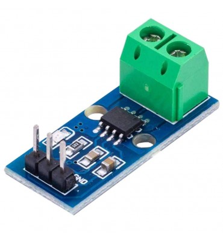

# ACS712 - Sensor de Corriente

El **ACS712** es un sensor que permite medir corriente alterna (AC) y corriente continua (DC) de forma aislada.  
Su salida es una señal analógica proporcional a la corriente que circula por el conductor, con un voltaje de referencia de 2.5 V cuando la corriente es cero.  
Existen tres modelos según el rango de medición: **5 A**, **20 A** y **30 A**, cada uno con diferente sensibilidad (mV/A).

El sensor está montado en una pequeña placa con terminales de tornillo para la conexión de la carga y pines para la interfaz con el microcontrolador.  
Es ampliamente utilizado en aplicaciones de monitoreo de consumo eléctrico, protección de circuitos y adquisición de datos.

# Uso aplicado en Newton 💻

El ACS712 se emplea para **registrar el consumo de corriente del sistema del microscopio y su LED SMD** durante periodos prolongados.  
Esto permite identificar variaciones en el consumo que puedan estar relacionadas con fallos en la soldadura o en el comportamiento térmico del LED.

Al correlacionar estos datos con la temperatura y humedad (DHT11), temperatura puntual (MAX6675) y la marca de tiempo (DS1302), es posible **detectar patrones de funcionamiento que expliquen por qué la pasta del LED se desuelda** bajo ciertas condiciones.

# Conexiones aplicadas para el uso ⚙️

| Conexiones     | ACS712  | Raspberry Pi Pico |
| :------------- | :------ | :---------------- |
| Alimentación   | VCC     | 5V (Pin 40)       |
| Tierra         | GND     | GND (Pin 38)      |
| Salida analógica | OUT   | GP26 (ADC0)       |

# Imagen del sensor

[ACS712 Datasheet - Allegro Microsystems](https://www.allegromicro.com/-/media/files/datasheets/acs712-datasheet.ashx)