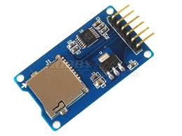

# HW 125

El **MicroSD Card Module** es un adaptador que permite a un microcontrolador leer y escribir datos en tarjetas microSD. Cuenta con un regulador de voltaje integrado que convierte de 5V a 3.3V, lo que lo hace compatible con la raspberry pi pico. Este módulo es ideal para aplicaciones que requieren almacenamiento masivo de datos, como registros de sensores, archivos de configuración, o captura de datos para análisis posterior. El módulo soporta tarjetas microSD (hasta 2 GB) y microSDHC (hasta 32 GB).

# Uso aplicado en Newton 💻

Este módulo MicroSD se emplea para **guardar toda la información recopilada por los sensores** (DHT11, MAX6675, ACS712) y el reloj en tiempo real (DS1302) durante un mes completo de funcionamiento.  
Estos registros incluyen temperatura ambiente, humedad relativa, temperatura, corriente y marcas de tiempo precisas.

Tras el periodo de medición, los datos son extraídos y procesados para generar gráficos y calcular parámetros. Esto permite **analizar las condiciones que provocan que la pasta del LED del microscopio se desuelde**, correlacionando las variables ambientales con los fallos observados.

# Conexiones aplicadas para el uso ⚙️

| Conexiones        | MicroSD Module | Raspberry Pi Pico |
| :---------------- | :------------- | :---------------- |
| Alimentación      | VCC            | VSYS (Pin 39)       |
| Tierra            | GND            | GND (Pin 38)      |
| Datos de salida   | MISO           | GP4 (SPI0 RX) (Pin 6)   |
| Datos de entrada  | MOSI           | GP3 (SPI0 TX) (Pin 5)   |
| Reloj SPI         | SCK            | GP2 (SPI0 SCK) (Pin 4) |
| Selección de chip | CS             | GP5 (SPI0 CSn)  (Pin 7) |

# Imagen del Adaptador 

# Especificaciones del DS1302

[Datasheet - MicroSD Card Module (PDF)](https://cdn.awsli.com.br/945/945993/arquivos/Datasheet-MicroSD-Module.pdf)
